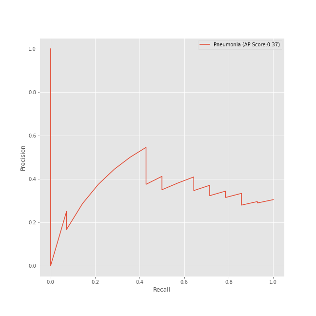
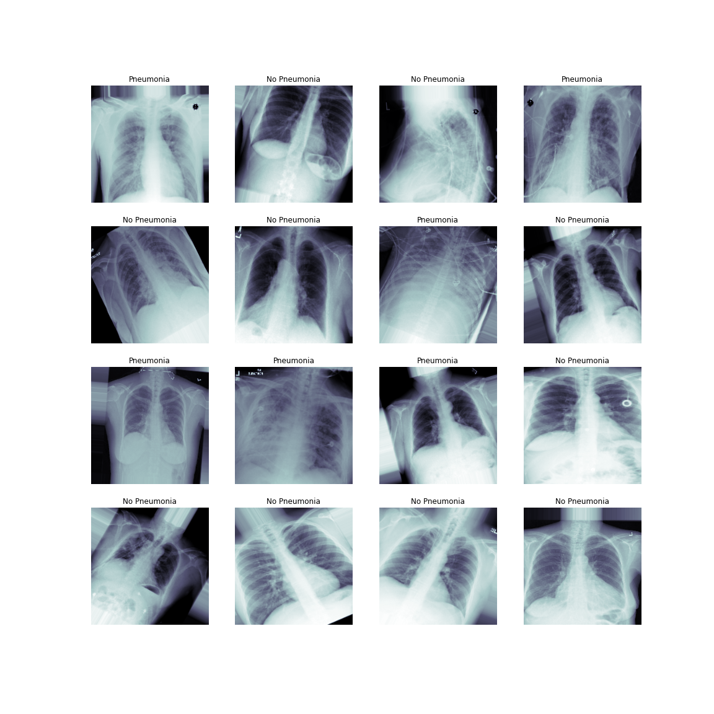

# FDA  Submission

**Nafisa Bulsara:**

**PneumonAI: Pneumonia detection from X-ray images using AI:**

## Algorithm Description 

### 1. General Information

**Intended Use Statement:** 
This algorithm is intended to aid radiologists in identification of pneumonia from x-ray images

**Indications for Use:**
The algorithm identifies chest X-ray images from males and females between the age groups of 1 to 99. The chest X-ray images have to be positioned either Anterior/Posterior or Posterior/Anterior and modality should be digital radiography. 

**Device Limitations:**
This device is not intended for diagnostic purposes. The algorithm has been trained on data that is positioned either AP or PA. 

**Clinical Impact of Performance:**


### 2. Algorithm Design and Function

<< Insert Algorithm Flowchart >>

**DICOM Checking Steps:**

This algorith uses pydicom library to asses the DICOM image for all limitations. The algorithms first checks if the modality is "DX", the patien position is "AP" ot "PA" and the body part examined is "Chest". If the DICOM does not meet all these criterias, the X-ray will not be assessed.


**Preprocessing Steps:**
The pixel_array from the DICOM image is rescaled by dividing with 255. It is also stacked and resized to fit the input shape of the model (1,244,244,3)

**CNN Architecture:**
The architecture used to build the model is called VGG16 and contains the following layers:


**Layer (type)                Output Shape              Param :**
_________________________________________________________________
model_1 (Model)              (None, 7, 7, 512)         14714688  
_________________________________________________________________
flatten_1 (Flatten)          (None, 25088)             0         
_________________________________________________________________
dropout_1 (Dropout)          (None, 25088)             0         
_________________________________________________________________
dense_1 (Dense)              (None, 512)               12845568  
_________________________________________________________________
dense_2 (Dense)              (None, 1)                 513       

-----------------------------------------------------------------
Total params: 27,560,769
Trainable params: 15,205,889
Non-trainable params: 12,354,880
_________________________________________________________________


### 3. Algorithm Training

**Parameters:**
* Types of augmentation used during training: 
    ``` horizontal_flip = True, 
        vertical_flip = False, 
        height_shift_range = 0.1, 
        width_shift_range = 0.1, 
        rotation_range = rotation, 
        shear_range = shear,
        zoom_range = zoom```

* Batch size: `32`
* Optimizer learning rate: `1e-4`
* Layers of pre-existing architecture that were frozen: `16`
* Layers of pre-existing architecture that were fine-tuned: `block5_pool`
* Layers added to pre-existing architecture: A `Flatten` layer, followed by `Dropout`, and a `Dense` layer with relu activation and another `Dense` layer with a sigmoid activation function.



**Final Threshold and Explanation:**

### 4. Databases
 (For the below, include visualizations as they are useful and relevant)

**Description of Training Dataset:** 
Training dataset contained 2290 images with 50% Pneumonia labels


**Description of Validation Dataset:** 
Validation dataset contained 1430 images with 20% Pneumonia labels

### 5. Ground Truth
The data here is taken from a larger x-ray dataset available through NIH. This dataset wasn't specifically collected for Pneumonia detection, so it has multiple diagnosis labels, like Atelectasis, Cardiomegaly, Consolidation, Edema, Effusion,
 Emphysema, Fibrosis, Hernia, Infiltration, Mass, Nodule, Pleural_Thickening and Pneumothorax.

These labels were obtained by using NLP to extract information, so the labels are as good as the NLP model accuracy (~0.9). 

### 6. FDA Validation Plan

**Patient Population Description for FDA Validation Dataset:**
The population included in this dataset contain both males and females, within the age group of 1 to 100. The xray images contain patients with comorbidities mentioned above, and many of them don't contain any of these findings and are labeled as 'No findings'

**Ground Truth Acquisition Methodology:**
In order to obtain the ground truth on these patients, a radiology review can be conducted by taking the opinion of a panel of radiologists.

**Algorithm Performance Standard:**

We can use an f1 score to calculate the algorithm's performance. The standard f1 score - based on radiology panel review is currently at an average 0.387. This model's f1 score is 0.4394 which is better. 

